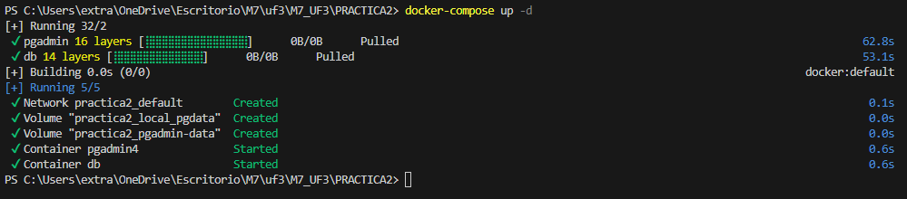
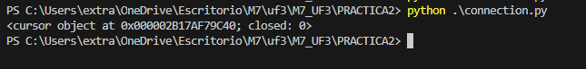
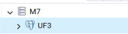
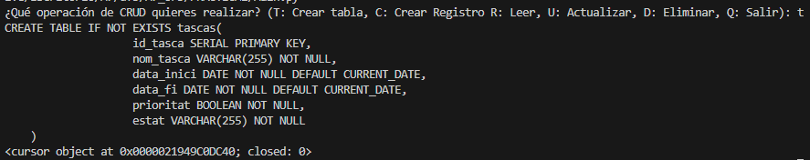
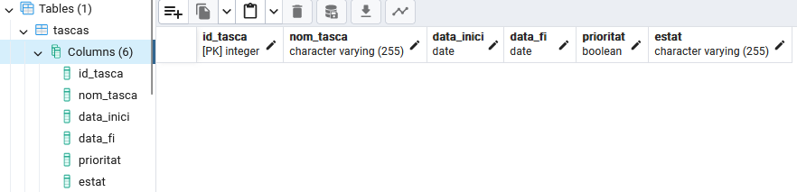
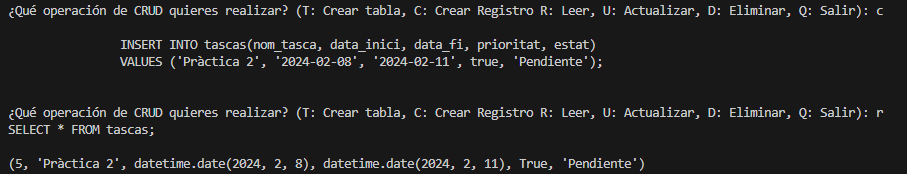
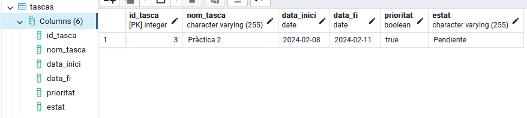
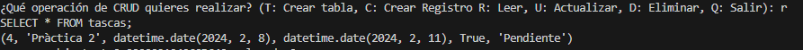
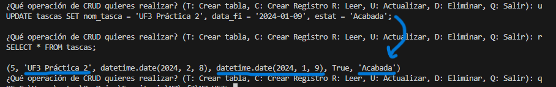
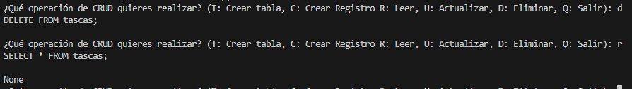

# PRÀCTICA 2 - PYTHON + POSTGRESQL

### Creación de servicios docker: 

### Connexión / Cursor 

### Servidor en PostgreSQL:

## Operaciones CRUD con Python psycopg2

### Crear tabla:

**Tabla en PostgreSQL:**

### Crear registro (INSERT)

### Leer elementos en la tabla (SELECT)

### Actualizar los datos de la tabla (UPDATE)

### Eliminar registros de la tabla (DELETE)
